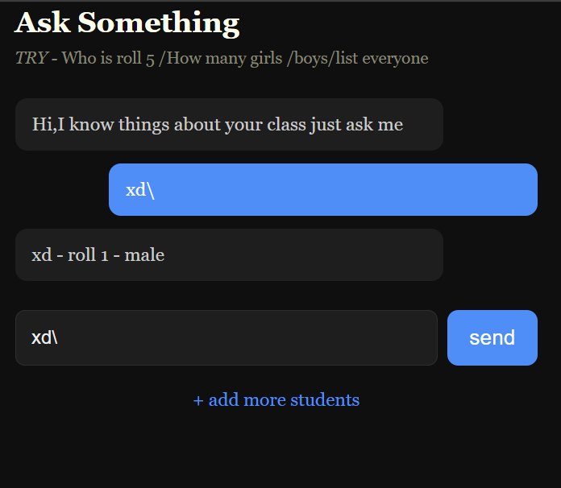

## ClassBot

A SIMPLE PYTHON BOT WHICH GIVES AUTOMATED RESPONSE WHEN ASKED ANY QUESTION ABOUT CLASS INCLUDING ROLL NO. NAME GENDER TEACHER NAME AND SOME MORE.

## WHAT IT IS TECHNICALLY AND HOW IT GOT CREATED

It is a basic python loop coded bot.

It integrates flask to connect with html and css where  in html there is inline js very little

I used json file for storing data as i dont know sql and in json just used python lik storage

In this there is a basic but clean ui and some data interpreted so bot give the automated response

## HOW TO USE

FIRST YOU HAVE TO ADD YOUR NAME AND CLASS 

SECONDLY YOU HAVE TO ADD CHILDRENS NO LIMITATION BUT  ADD ONE TO GO TO BOT

ASK SOME QUESTIONS TO BOT AND HE WILL RESPOND TO YOU

# WHAT I CAN ASK

YOU CAN ASK-

who is the teacher

teacher name

what is the class name

which class

grade

standard

how many students

total students

strength

amount

who is roll 5

roll 3

how many girls

how many boys

how many female

how many male

list

list all

all students

everyone

By name you can also ask 

i will add more in future:)

## HOW IT LOOKS LIKE

https://classbot-production.up.railway.app/

PREVIEW IT

#SOME THINGS TO NOTE

I DID NOT FILLED MANY INFORMATION OR LINES OF CODE SO IT IS NOT A PERFECT BOT CAN GIVE WRONG RESPONSE OR BE BUGGY JUST A DEMO 

I USED AI FOR FLASK INTEGRATION OF DATA.JSON AND USED IT FOR THE CHAT BUBBLE AS IT WAS LIKE IT WAS NOT FITTING PERFECTLY USED FOR ITS PLACEMENT.

THANK YOU MADE BY ATHARVA.

